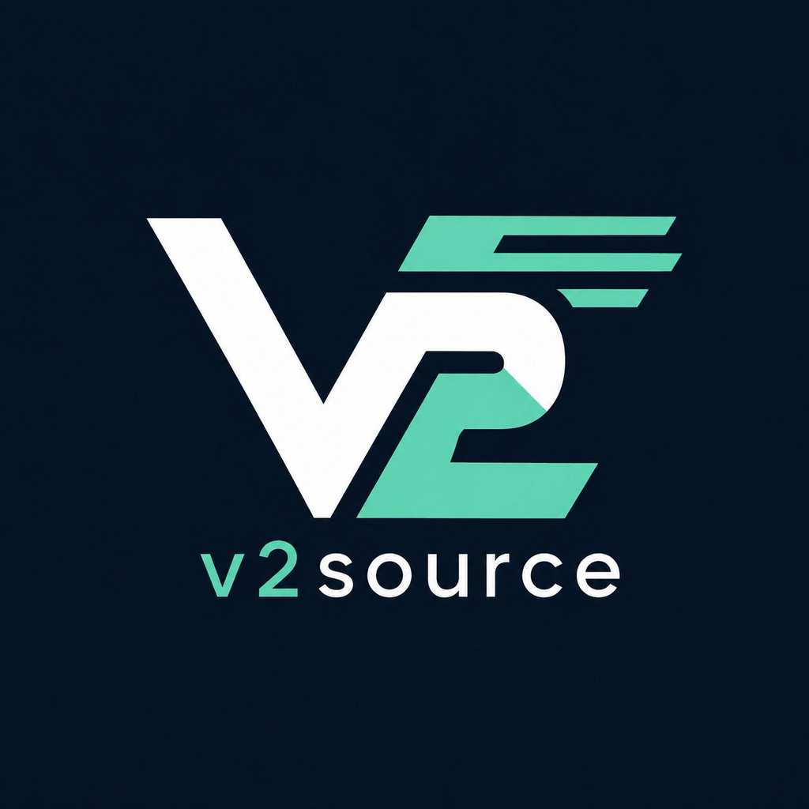

<div align="center">



# v2source

**کلاینت VPN / V2Ray رایگان، ساده و سبک برای اندروید**
یک لیست سرور آماده + اتصال با یک تپ. بدون تنظیمات پیچیده.

[](https://github.com/v2rayCrow/v2source_app/actions/workflows/build.yml)
[](https://github.com/v2rayCrow/v2source_app/releases/latest)
[](LICENSE)
[](#)
[](https://t.me/V2Source)

[دانلود آخرین نسخه](https://github.com/v2rayCrow/v2source_app/releases/latest) •
[کانال تلگرام](https://t.me/V2Source) •
[گزارش باگ](https://github.com/v2rayCrow/v2source_app/issues)

</div>

---

## درباره v2source

**v2source** یک اپلیکیشن اندرویدی ساده برای اتصال به سرورهای V2Ray/VLESS هست که به‌صورت خودکار از یک منبع اشتراک (subscription) لیست سرور می‌گیره، دسته‌بندی می‌کنه و امکان تست پینگ واقعی و اتصال سریع رو فراهم می‌کنه.

### ✨ امکانات

- 🔄 دریافت خودکار لیست سرورها از subscription (هر ۶ ساعت به‌روزرسانی می‌شه)
- 🌍 دسته‌بندی خودکار سرورها بر اساس کشور (پرچم) + فیلتر با یک تپ
- 🔢 شماره‌گذاری سرورهای هم‌کشور (مثلاً فنلاند #۱ تا #۱۰) تا با هم قاطی نشن
- ⚡ تست پینگ واقعی (Real Delay) و مرتب‌سازی زنده‌ی سرورها بر اساس سرعت
- 🔁 جابجایی سریع بین سرورها؛ کافیه روی یک سرور دیگه بزنی، بقیه‌ش خودکاره
- 🌗 تم روشن / تیره
- 🇮🇷 / 🇬🇧 پشتیبانی کامل از فارسی (راست‌به‌چپ) و انگلیسی
- 🧱 ساخته‌شده با Flutter — سبک، بدون تبلیغات، بدون نیاز به ثبت‌نام

---

## 📥 نصب

از بخش **[Releases](https://github.com/v2rayCrow/v2source_app/releases/latest)** آخرین فایل APK رو دانلود و نصب کن.

> هر آپدیت با یک کلید امضای ثابت منتشر می‌شه، پس برای نصب نسخه‌های بعدی نیازی به حذف نسخه قبلی نیست — فقط APK جدید رو نصب کن.

---

## 🛠 ساخت از سورس (Build from source)

```bash
git clone https://github.com/v2rayCrow/v2source_app.git
cd v2source_app
flutter pub get
flutter build apk --release
```

خروجی در مسیر `build/app/outputs/flutter-apk/app-release.apk` قرار می‌گیره.

بیلد رسمی هم از طریق GitHub Actions به‌صورت خودکار روی هر push و هر تگ نسخه (`vX.Y.Z`) انجام می‌شه و در بخش Releases منتشر می‌شه.

---

## 🤝 مشارکت

اگه باگی دیدی یا پیشنهادی داری، از بخش [Issues](https://github.com/v2rayCrow/v2source_app/issues) اطلاع بده یا Pull Request بفرست.

## 📢 کانال

اخبار، آپدیت‌ها و اطلاعیه‌ها در کانال تلگرام: **[@V2Source](https://t.me/V2Source)**

## 📄 مجوز

این پروژه تحت مجوز [MIT](LICENSE) منتشر شده.

---

<div align="center">
<sub>Built with Flutter • Made for a free internet</sub>
</div>
